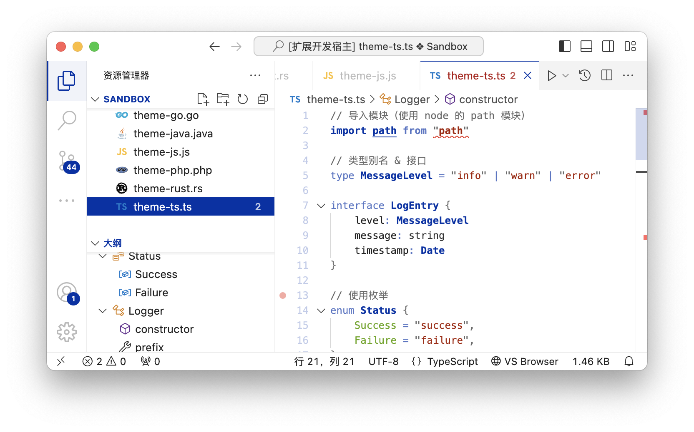

# VSCode Theme / Niveus

## Features

* Supports 6 theme colors
* Offers both Dark and Light modes
* Functional color scheme (see explanation below)

## Recommendations

* For consistent visual styling, we recommend setting `"editor.bracketPairColorization.enabled": false`

## Functional Color Scheme

Through extensive programming experience, I've realized that when working with editors, our focus tends to be more on workflow and logic rather than syntax and keywords (while they appear highlighted, they don't seem crucial for readability).

Unlike other color themes that assign different colors to various syntax tokens to create differentiation, the Niveus theme adopts a minimal color approach by de-emphasizing keyword presentation. This design reduces visual distractions and helps highlight what truly matters in the code.