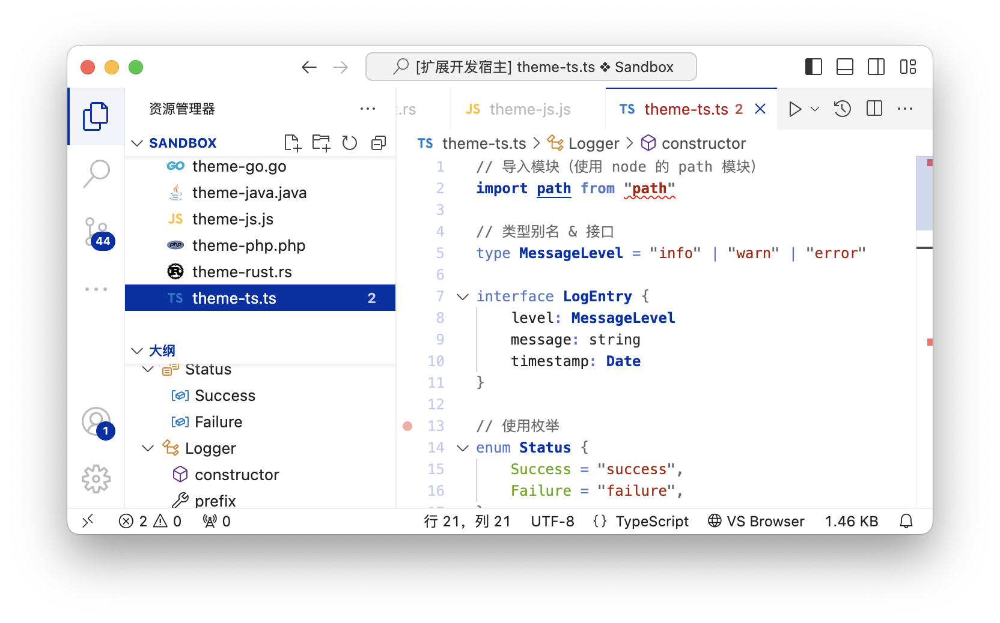

# VSCode Theme / Niveus

## 特性

* 支持 6 种主题色
* 支持 深色 和 浅色 模式
* 功能性配色（详见下文解释）

## 建议

* 为保持视觉风格统一，建议设置 `"editor.bracketPairColorization.enabled": false`

## 功能性配色

在长期的编程过程中，我发现面对编辑器时的注意点更多是在流程和逻辑上，而不是在语法和关键字上（虽然它有关键的字样，但好像对于可读性来说并不关键）。

因此，相比于其他配色主题为不同的语法 Token 分配不同的颜色来制造差异化。Nivues 主题通过弱化关键字的呈现，实现了更少的配色采用。这样的好处是，减少了干扰项，突出了真正关键的部分。